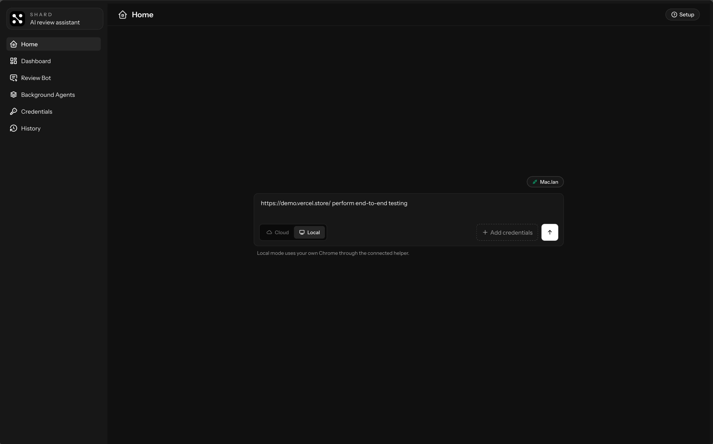
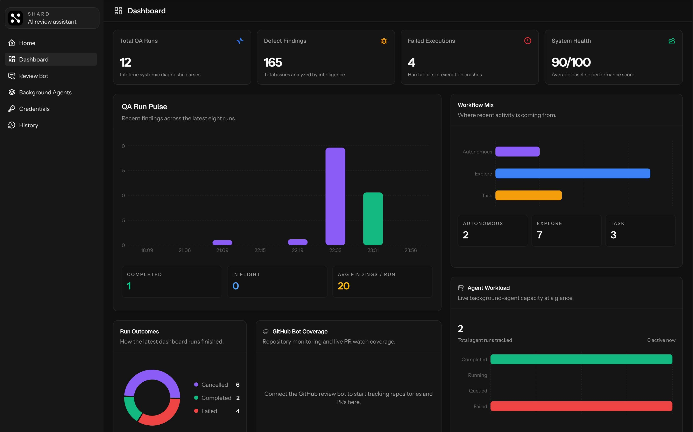
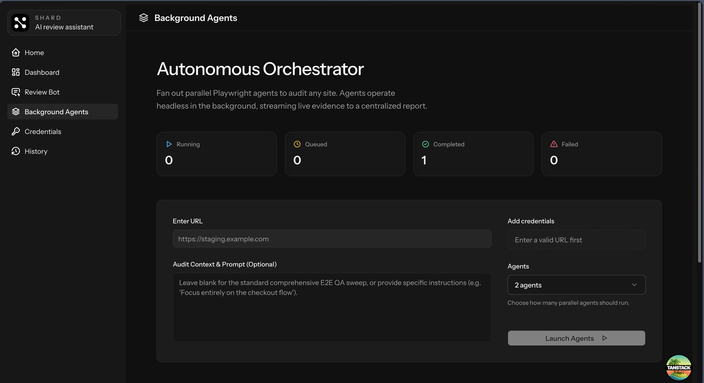
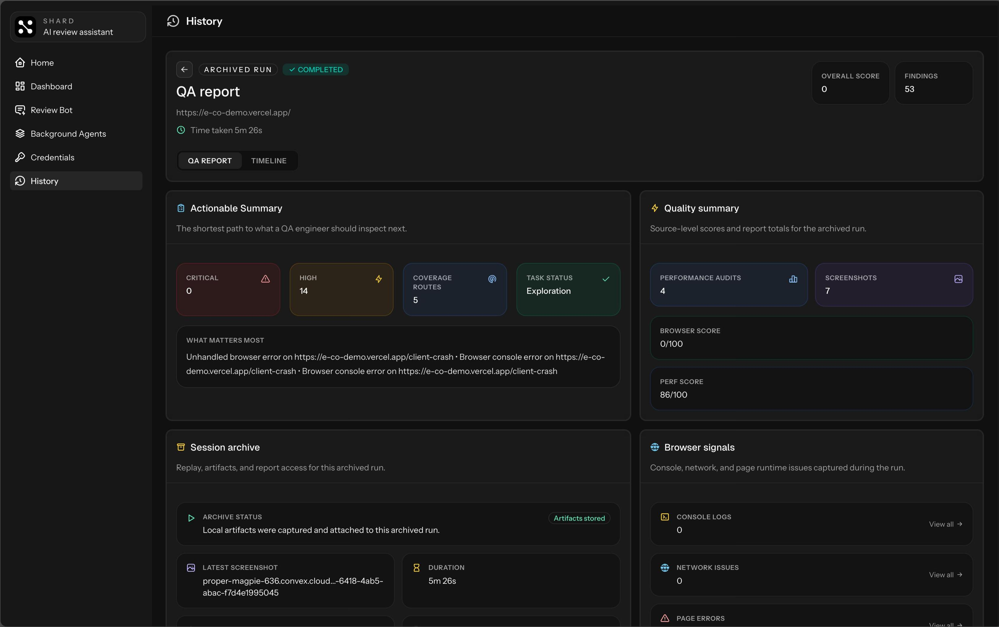
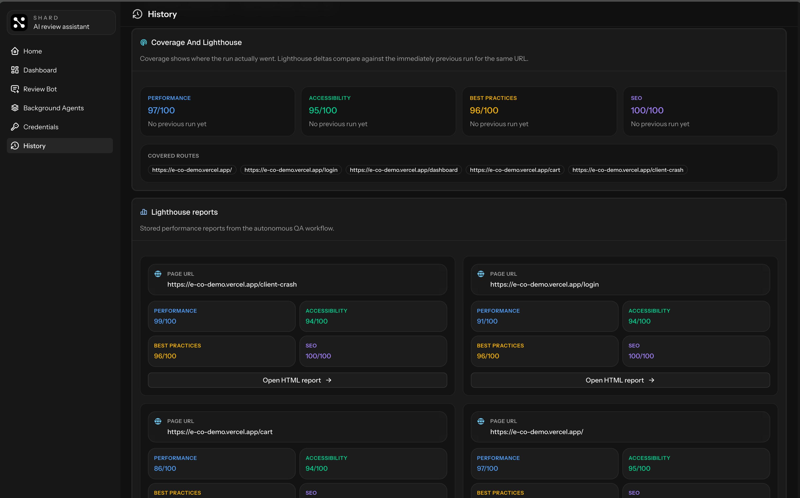

# Shard

Shard is an autonomous web QA app with a built-in GitHub review bot. It helps you run browser-based QA, launch background audits, save reusable credentials, review archived reports, inspect pull requests, and pre-crawl sites with Firecrawl for broader coverage.

## Features

- **Exploratory and task-based QA automation** — run the agent against any URL with or without instructions
- **Dual browser modes** — Steel hosted sessions with live replay, or local Chrome via the helper process
- **Background agent orchestration** — spin up multiple agents in parallel across five predefined coverage lanes for broader site sweeps
- **Site crawling and indexing** — crawl a site in parallel with QA runs to build a sitemap, classify page types, extract forms, and surface dead links
- **Crawl-assisted QA** — use crawled pages to seed navigation, pick better start URLs for task runs, and generate synthetic form data for forms
- **Live run monitoring** — real-time agent transcript, step timeline, browser session embed, report, and cancellation
- **Archived reports** — findings by severity, browser signals, screenshots, session replay, per-page Lighthouse scores, crawl coverage, sitemap data, and form inventory
- **Credential management** — encrypted site credentials with per-site defaults and auto-matching at run time
- **Dashboard** — run trends, outcome distribution, findings over time, orchestrator status, and crawl metrics
- **GitHub review bot** — tracks PRs, runs automated reviews, and posts inline code feedback via GitHub App

## Use Cases

- Smoke test a deployed app by giving the agent a URL
- Verify a specific flow such as sign in, checkout, onboarding, or CRUD
- Pre-crawl a site so the agent can cover more pages instead of wandering link-by-link
- Discover dead links and missing routes even when the agent does not click into every page manually
- Extract a site-wide form inventory and use synthetic values to test forms more realistically
- Run broader background sweeps across a site with multiple agents in parallel
- Reuse saved credentials for authenticated test flows
- Review completed runs with screenshots, findings, performance data, sitemap coverage, and crawl summaries
- Monitor QA trends over time from the dashboard
- Review pull requests inside the app before shipping changes

## Spin Up

Quick start:

```bash
pnpm install
pnpm dev
docker-compose up -d
```

Optional local Chrome support:

```bash
pnpm local-helper
```

The app runs on `http://localhost:3000`.

For full setup instructions, environment variables, and troubleshooting, see [SETUP.md](./SETUP.md).

## Prerequisites

- Node.js 22 or newer
- `pnpm` 10 or newer
- A working Convex deployment
- An OpenAI API key
- A Steel API key
- Google Chrome for local browser runs
- Docker if you want to run the Inngest dev service with Docker Compose

## Installation And Environment

1. Install dependencies with `pnpm install`
2. Add your environment variables in `.env` and `.env.local`
3. Start the app with `pnpm dev`
4. Start the background worker with Docker Compose or the Inngest dev command from [SETUP.md](./SETUP.md)
5. Start `pnpm local-helper` if you want local Chrome runs

Main environment values you will need:

- `VITE_CONVEX_URL`
- `CREDENTIAL_ENCRYPTION_KEY`
- `OPENAI_API_KEY`
- `STEEL_API_KEY`
- `APP_BASE_URL`
- `LOCAL_HELPER_SECRET` for local Chrome mode
- `FIRECRAWL_API_URL` for the Firecrawl endpoint
- `FIRECRAWL_API_KEY` for authenticated Firecrawl crawling
- GitHub app and OAuth keys if you want the review bot

Firecrawl is optional. When configured, Shard will:

- start a crawl alongside standalone runs and background orchestrators
- classify discovered pages into useful buckets like auth, product, checkout, docs, and forms
- detect dead links and turn them into QA findings
- extract form structures and generate synthetic values for form testing
- expand coverage and Lighthouse auditing beyond only the pages the agent clicked manually

## Screenshots

<table>
  <tr>
    <td align="center" valign="top" width="50%">
      
      <br />
      <sub>Home: start a QA run with a URL, browser mode, and optional saved credentials.</sub>
    </td>
    <td align="center" valign="top" width="50%">
      
      <br />
      <sub>Dashboard: track run volume, findings, failures, and overall system health.</sub>
    </td>
  </tr>
  <tr>
    <td align="center" valign="top" width="50%">
      
      <br />
      <sub>Background Agents: launch parallel audits for broader site coverage.</sub>
    </td>
    <td align="center" valign="top" width="50%">
      
      <br />
      <sub>Review Bot: connect repositories and monitor tracked pull requests.</sub>
    </td>
  </tr>
  <tr>
    <td align="center" valign="top" width="50%">
      
      <br />
      <sub>QA Report: inspect findings, screenshots, artifacts, and browser signals.</sub>
    </td>
    <td align="center" valign="top" width="50%">
      
      <br />
      <sub>History: review route coverage and per-page Lighthouse results.</sub>
    </td>
  </tr>
</table>

## Stack

- TanStack Start
- React
- Convex
- Inngest
- Playwright
- Steel
- Firecrawl
- OpenAI SDK
- Lighthouse
- Octokit and Probot

## Notes

### Challenges

- Fine-tuning the agent prompt so it follows instructions reliably and performs useful testing took a good amount of trial and error.
- Keeping live Steel sessions, local Chrome sessions, and headless background agents aligned under the same QA engine
- Blending real browser exploration with pre-crawled site data without breaking the agent's normal fallback behavior
- Handling login workflows safely by matching stored credentials at runtime rather than leaking secrets into prompts

### Assumptions

- A working Convex deployment is available
- OpenAI and Steel credentials are available
- Firecrawl credentials are available if you want crawl-backed QA enhancements
- Site credentials are added inside the app when authenticated flows need to be tested

### Limitations

- Full functionality depends on external services such as Convex, Inngest, Steel, OpenAI, and optionally Firecrawl
- Local Chrome runs require the helper process and a compatible Chrome install on the same machine
- Crawl-backed coverage depends on Firecrawl reachability and the quality of the returned site graph and page metadata
- The GitHub review bot needs full GitHub App and OAuth setup before it becomes usable
